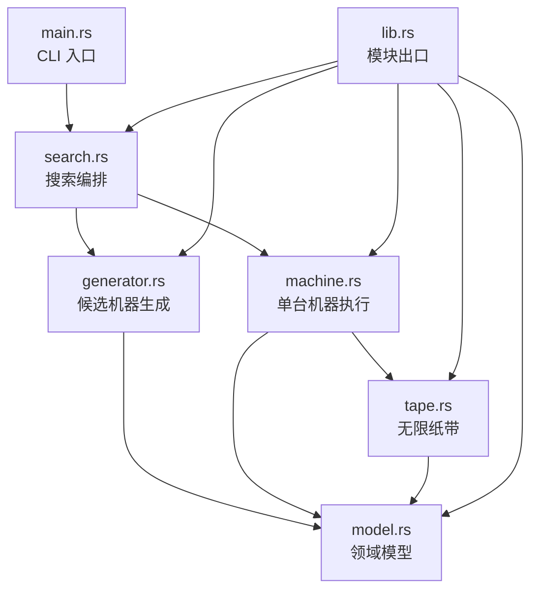
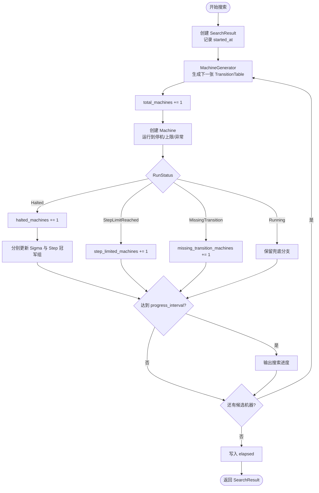

# busy-beaver-rs v0.3 技术文档

## 1. 版本目标

v0.3 的核心目标是把 Busy Beaver 搜索结果的语义拆清楚。

在 Busy Beaver 问题里，常见的两个指标是：

| 指标 | 含义 |
|---|---|
| `Σ(n)` | 所有会停机的 `n` 状态机器中，停机时纸带上 `1` 的最大数量 |
| `S(n)` | 所有会停机的 `n` 状态机器中，运行步数的最大值 |

v0.2 中只有一个“最优机器”结果，更新策略是先比较 `ones`，再比较 `steps`。这个策略可以用于观察，但会把两个不同问题混在一起。

v0.3 改为分别维护：

- `sigma_champions`：`Σ(n)` 冠军组，按停机时 `1` 的数量更新。
- `step_champions`：`S(n)` 冠军组，按停机运行步数更新。

同时增加：

- 搜索进度输出。
- 搜索总耗时统计。
- BB(2) 结果语义回归测试。

## 2. 当前模块结构

```text
src/
├── lib.rs
├── main.rs
├── model.rs
├── tape.rs
├── machine.rs
├── generator.rs
└── search.rs
```

模块关系图：



### 2.1 `model.rs`

负责基础领域模型：

- `Symbol = u8`
- `State`
  - `State::Normal(u8)`：普通状态，`0` 表示 `A`，`1` 表示 `B`。
  - `State::Halt`：停机状态。
- `Direction`
  - `Left`
  - `Right`
- `Transition`
  - `write`
  - `direction`
  - `next_state`
- `RuleKey = (State, Symbol)`

这一层只描述图灵机的状态转移结构，不负责执行，也不负责搜索。

### 2.2 `tape.rs`

负责无限纸带抽象。

当前实现使用：

```rust
HashMap<i64, Symbol>
```

表示稀疏纸带。未写入的位置默认读作 `0`，写入 `0` 时会删除对应位置，以维持“空白纸带默认全 0”的语义。

主要接口：

- `read(position)`
- `write(position, symbol)`
- `count_ones()`

### 2.3 `machine.rs`

负责单台图灵机执行。

核心类型：

- `TransitionTable = HashMap<RuleKey, Transition>`
- `RunStatus`
  - `Running`
  - `Halted`
  - `MissingTransition`
  - `StepLimitReached`
- `Machine`

`Machine` 从以下初始条件开始运行：

```text
state = A
head = 0
tape = 全 0
steps = 0
```

单步执行流程：

```text
读取当前符号
        ↓
用 (当前状态, 当前符号) 查找转移规则
        ↓
写入新符号
        ↓
移动读写头
        ↓
切换到下一个状态
        ↓
steps += 1
        ↓
如果进入 Halt，则返回 Halted
```

`run(max_steps)` 会持续执行 `step()`，直到：

- 机器停机。
- 缺失转移规则。
- 达到最大步数。

### 2.4 `generator.rs`

负责枚举候选机器。

对于 `n` 个普通状态、`m` 个符号：

```text
规则入口数量 = n * m
```

经典 Busy Beaver 当前固定为 `m = 2`。

每个规则入口的候选转移数量为：

```text
写入符号数量 * 移动方向数量 * 下一状态数量
= m * 2 * (n + 1)
```

其中 `n + 1` 包括所有普通状态和 `Halt` 状态。

因此总搜索空间为：

```text
(m * 2 * (n + 1)) ^ (n * m)
```

对于 `BB(2)`：

```text
(2 * 2 * 3) ^ (2 * 2) = 12 ^ 4 = 20736
```

当前生成器使用回溯方式，每生成一张完整 `TransitionTable`，就通过回调交给搜索器处理。

### 2.5 `search.rs`

负责组合生成器和机器执行器。

当前搜索流程：

```text
创建 MachineGenerator
        ↓
逐张生成 TransitionTable
        ↓
用 TransitionTable 创建 Machine
        ↓
运行 Machine
        ↓
按 RunStatus 更新统计
        ↓
如果 Halted，则分别更新 Σ(n) 与 S(n) 冠军组
        ↓
按 progress_interval 输出搜索进度
        ↓
返回 SearchResult
```

搜索执行流程图：



## 3. v0.3 结果数据结构

### 3.1 `ChampionGroup`

```rust
pub struct ChampionGroup {
    pub best_ones: usize,
    pub best_steps: u64,
    pub tables: Vec<TransitionTable>,
}
```

含义：

- `best_ones`：当前冠军组里观察到的最大 `1` 数量。
- `best_steps`：当前冠军组里观察到的最大运行步数。
- `tables`：所有并列冠军机器的状态转移表。

同一个冠军组可能包含多台机器，因为不同状态转移表可能在目标指标上并列第一。

### 3.2 `SearchResult`

```rust
pub struct SearchResult {
    pub total_machines: usize,
    pub halted_machines: usize,
    pub step_limited_machines: usize,
    pub missing_transition_machines: usize,
    pub sigma_champions: ChampionGroup,
    pub step_champions: ChampionGroup,
    pub elapsed: Duration,
}
```

统计字段：

- `total_machines`：已经搜索的机器总数。
- `halted_machines`：正常停机机器数量。
- `step_limited_machines`：达到最大步数上限的机器数量。
- `missing_transition_machines`：缺失转移规则的机器数量。
- `sigma_champions`：`Σ(n)` 冠军组。
- `step_champions`：`S(n)` 冠军组。
- `elapsed`：搜索总耗时。

## 4. 冠军组更新规则

### 4.1 `Σ(n)` 冠军组

`Σ(n)` 只按 `ones` 判断主指标：

```text
如果冠军组为空：
    当前机器进入冠军组

如果 ones > best_ones：
    清空旧冠军组
    当前机器成为新的冠军组

如果 ones == best_ones：
    当前机器加入冠军组
    best_steps 更新为当前冠军组内最大 steps
```

注意：`best_steps` 在这里不是 `Σ(n)` 的主排序依据，只是辅助展示字段。

`Σ(n)` 更新流程图：

```mermaid
flowchart TD
    input[输入 Halted 机器<br/>ones, steps, table] --> empty{冠军组为空?}
    empty -->|是| replace[写入 best_ones / best_steps<br/>清空并加入 table]
    empty -->|否| better{ones > best_ones?}
    better -->|是| replace
    better -->|否| tie{ones == best_ones?}
    tie -->|是| append[加入 table<br/>best_steps = max(best_steps, steps)]
    tie -->|否| ignore[忽略当前机器]
    replace --> done([完成])
    append --> done
    ignore --> done
```

### 4.2 `S(n)` 冠军组

`S(n)` 只按 `steps` 判断主指标：

```text
如果冠军组为空：
    当前机器进入冠军组

如果 steps > best_steps：
    清空旧冠军组
    当前机器成为新的冠军组

如果 steps == best_steps：
    当前机器加入冠军组
    best_ones 更新为当前冠军组内最大 ones
```

注意：`best_ones` 在这里不是 `S(n)` 的主排序依据，只是辅助展示字段。

`S(n)` 更新流程图：

```mermaid
flowchart TD
    input[输入 Halted 机器<br/>ones, steps, table] --> empty{冠军组为空?}
    empty -->|是| replace[写入 best_steps / best_ones<br/>清空并加入 table]
    empty -->|否| better{steps > best_steps?}
    better -->|是| replace
    better -->|否| tie{steps == best_steps?}
    tie -->|是| append[加入 table<br/>best_ones = max(best_ones, ones)]
    tie -->|否| ignore[忽略当前机器]
    replace --> done([完成])
    append --> done
    ignore --> done
```

## 5. 命令行接口

当前入口：

```bash
cargo run -- <state_count> <max_steps> <progress_interval>
```

参数说明：

| 参数 | 含义 | 默认值 |
|---|---|---|
| `state_count` | 普通状态数量，例如 `2` 表示 `BB(2)` | `2` |
| `max_steps` | 单台机器最大运行步数 | `BB(2)` 和 `BB(3)` 默认为 `100`，其他为 `10000` |
| `progress_interval` | 每搜索多少台机器输出一次进度，`0` 表示关闭 | `10000` |

示例：

```bash
cargo run
cargo run -- 2
cargo run -- 3
cargo run -- 3 1000
cargo run -- 3 1000 100000
cargo run -- 2 100 0
```

进度输出格式：

```text
[progress] searched=10000 halted=4712 step_limited=5288 missing=0 elapsed=420.00ms
```

最终输出会分为两段：

```text
=== Sigma(n) 最多 1 冠军组 ===
...

=== S(n) 最长停机步数冠军组 ===
...
```

## 6. BB(2) 当前验证结果

使用：

```bash
CARGO_TARGET_DIR=/tmp/busy-beaver-rs-target cargo run -- 2 100 0
```

当前可得到：

```text
总机器数量: 20736
正常停机机器数量: 9784
达到步数上限机器数量: 10952
缺失转移规则机器数量: 0
```

`Σ(2)` 结果：

```text
最多 1 的数量: 4
最长运行步数: 6
冠军机器数量: 4
```

`S(2)` 结果：

```text
最长运行步数: 6
最多 1 的数量: 4
冠军机器数量: 40
```

这说明在当前枚举定义下，`Σ(2)` 和 `S(2)` 的指标值符合经典结果，但两类冠军组的机器集合并不相同。

## 7. 当前实现边界

当前版本仍然是朴素搜索，主要瓶颈来自：

- `TransitionTable` 使用 `HashMap`，每一步执行都要做哈希查找。
- 生成器回溯过程中频繁 `insert`、`remove` 和 `clone`。
- 每台候选机器都持有独立的 `HashMap` 转移表。
- 搜索流程是单线程。
- 纸带也使用 `HashMap`，访问成本高于数组。

因此：

- `BB(2)` 可以完整跑完。
- `BB(3)` 搜索空间已经明显变大，当前实现不适合作为长期方案。
- 后续 v0.4 应优先做数组引擎，减少哈希表和 clone 开销。

## 8. v0.4 技术方向

v0.4 计划把规则表从 `HashMap` 改为数组或 `Vec`。

规则 key 可以编码为：

```text
index = state_index * symbol_count + symbol
```

对于经典二符号 Busy Beaver：

```text
index = state_index * 2 + symbol
```

例如：

```text
A0 -> 0
A1 -> 1
B0 -> 2
B1 -> 3
C0 -> 4
C1 -> 5
```

预期收益：

- 规则查找从哈希查找变为数组下标访问。
- 减少 `RuleKey` 的构造和哈希成本。
- 降低 `TransitionTable` 克隆成本。
- 为后续候选机器 ID 编码和并行搜索打基础。

v0.4 建议先保持外部搜索语义不变，只替换内部执行引擎。这样可以继续使用 v0.3 的 BB(2) 回归测试验证行为是否一致。
