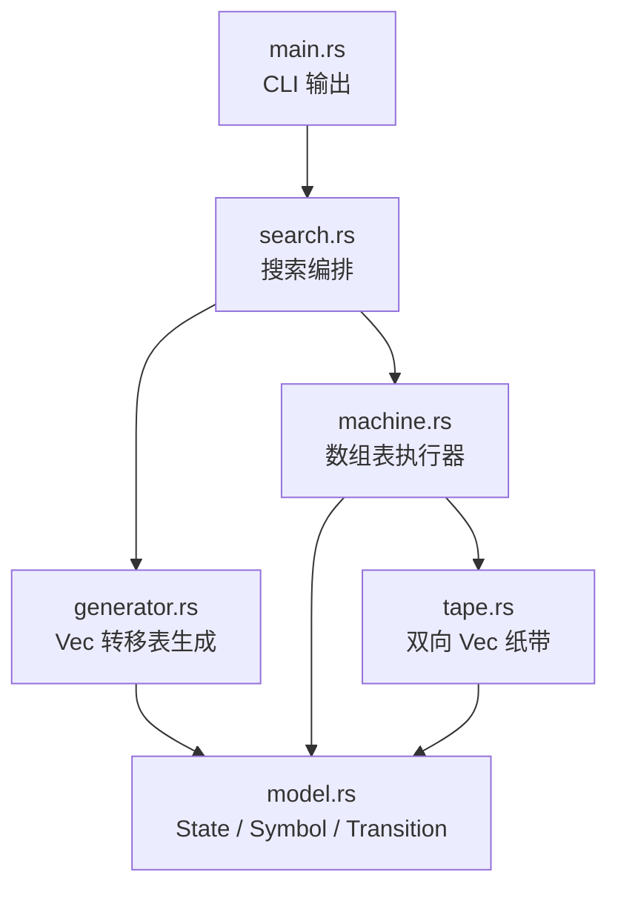
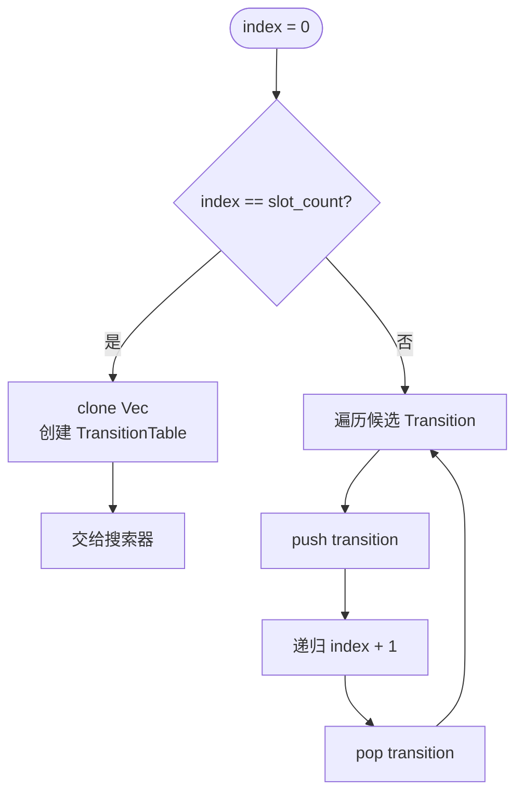

# busy-beaver-rs v0.4 技术文档

## 1. 版本目标

v0.4 的目标是优化单线程执行路径，把 v0.3 中依赖 `HashMap` 的核心结构改成数组访问。

本版本完成两处改造：

- 状态转移表：`HashMap<(State, Symbol), Transition>` -> `Vec<Transition>`。
- 纸带：`HashMap<i64, Symbol>` -> 正负两段 `Vec<Symbol>`。

v0.4 不改变搜索语义：

- `Σ(n)` 仍然按停机时纸带上 `1` 的数量选冠军组。
- `S(n)` 仍然按停机运行步数选冠军组。
- CLI 参数和输出结构保持兼容。

## 2. 总体结构



## 3. 状态转移表数组化

### 3.1 v0.3 结构

v0.3 使用：

```rust
HashMap<(State, Symbol), Transition>
```

每一步执行都需要：

```text
构造 key -> 计算哈希 -> 查找 HashMap -> 取出 Transition
```

### 3.2 v0.4 结构

v0.4 改为：

```rust
pub struct TransitionTable {
    symbol_count: u8,
    transitions: Vec<Transition>,
}
```

规则槽位按状态和符号顺序连续排列：

```text
index = state_id * symbol_count + symbol
```

经典二符号 Busy Beaver 中：

```text
index = state_id * 2 + symbol
```

例如 `BB(3)`：

| 规则 | index |
|---|---:|
| `A0` | 0 |
| `A1` | 1 |
| `B0` | 2 |
| `B1` | 3 |
| `C0` | 4 |
| `C1` | 5 |

### 3.3 查找流程

```mermaid
flowchart TD
    input[当前 state 与 symbol] --> halt{state 是 Halt?}
    halt -->|是| none[返回 None]
    halt -->|否| id[取出 state_id]
    id --> index[index = state_id * symbol_count + symbol]
    index --> get[transitions.get(index)]
    get --> transition[返回 Transition]
```

这样执行器不再创建 `RuleKey`，也不再做哈希查找。

## 4. 生成器改造

### 4.1 v0.3 生成方式

v0.3 的回溯过程维护一张 `HashMap`：

```text
insert 当前规则
        ↓
递归下一个规则槽位
        ↓
remove 当前规则
```

叶子节点克隆整张 `HashMap`。

### 4.2 v0.4 生成方式

v0.4 的回溯过程只维护一个 `Vec<Transition>`：

```text
push 当前 Transition
        ↓
递归下一个规则槽位
        ↓
pop 当前 Transition
```

叶子节点用当前 `Vec<Transition>` 创建 `TransitionTable`。



这种方式减少了：

- `RuleKey` 列表分配。
- `HashMap` 插入和删除。
- `HashMap` 克隆。
- 哈希表所有权转移成本。

## 5. 纸带双向数组化

### 5.1 数据结构

v0.4 的纸带结构：

```rust
pub struct Tape {
    positive_cells: Vec<Symbol>,
    negative_cells: Vec<Symbol>,
}
```

坐标映射：

| 纸带坐标 | 存储位置 |
|---:|---|
| `0` | `positive_cells[0]` |
| `1` | `positive_cells[1]` |
| `2` | `positive_cells[2]` |
| `-1` | `negative_cells[0]` |
| `-2` | `negative_cells[1]` |
| `-3` | `negative_cells[2]` |

未分配的位置默认读取为 `0`。

### 5.2 读写流程

```mermaid
flowchart TD
    pos[输入 position] --> sign{position >= 0?}
    sign -->|是| positive[使用 positive_cells<br/>index = position]
    sign -->|否| negative[使用 negative_cells<br/>index = -position - 1]
    positive --> op{读还是写?}
    negative --> op
    op -->|读| read[越界返回 0<br/>否则返回 cells[index]]
    op -->|写| resize{index >= len?}
    resize -->|是| grow[resize 到 index + 1<br/>空位填 0]
    resize -->|否| write[cells[index] = symbol]
    grow --> write
```

这个结构比 `HashMap<i64, Symbol>` 更适合当前模拟器，因为读写头通常在连续区域移动。

## 6. 保持不变的语义

v0.4 只替换内部数据结构，不改变外部行为：

- 搜索空间仍由 `state_count` 和 `symbol_count` 决定。
- 单台机器仍从 `A` 状态、`head = 0`、全 `0` 纸带开始。
- `max_steps` 仍用于截断疑似不停机机器。
- 停机机器仍分别进入 `Σ(n)` 和 `S(n)` 冠军组判断。

## 7. 回归验证

当前测试覆盖：

- `TransitionTable` 下标编码。
- 双向纸带正负坐标读写。
- 未分配纸带单元默认读 `0`。
- BB(2) 搜索结果：
  - `Σ(2) = 4`
  - `S(2) = 6`

验证命令：

```bash
CARGO_TARGET_DIR=/tmp/busy-beaver-rs-target cargo test --locked
CARGO_TARGET_DIR=/tmp/busy-beaver-rs-target cargo run -- 2 100 0
```

### 优化前
```text
=== Busy Beaver BB(2) 搜索结果 ===
最大运行步数: 100
搜索耗时: 841.55ms
总机器数量: 20736
正常停机机器数量: 9784
达到步数上限机器数量: 10952
缺失转移规则机器数量: 0

=== Sigma(n) 最多 1 冠军组 ===
冠军机器数量: 4
最多 1 的数量: 4
最长运行步数: 6
```

### 优化后
```text
最大运行步数: 100
搜索耗时: 83.48ms
总机器数量: 20736
正常停机机器数量: 9784
达到步数上限机器数量: 10952
缺失转移规则机器数量: 0

=== Sigma(n) 最多 1 冠军组 ===
冠军机器数量: 4
最多 1 的数量: 4
最长运行步数: 6
```

### 现在可以算 BB(3)了
```text
=== Busy Beaver BB(3) 搜索结果 ===
最大运行步数: 100
搜索耗时: 68.74s
总机器数量: 16777216
正常停机机器数量: 7571840
达到步数上限机器数量: 9205376
缺失转移规则机器数量: 0

=== Sigma(n) 最多 1 冠军组 ===
冠军机器数量: 40
最多 1 的数量: 6
最长运行步数: 14


=== S(n) 最长停机步数冠军组 ===
冠军机器数量: 16
最多 1 的数量: 5
最长运行步数: 21

```


## 8. 后续方向

v0.4 仍然保留了“生成一张完整机器表再运行”的模型。

后续 v0.5 可以继续优化：

- 用机器 ID 编码候选机器，避免生成阶段克隆 `Vec<Transition>`。
- 引入 `rayon` 并行遍历候选空间。
- 每个线程维护局部 `SearchResult`，最后合并冠军组。
- 将进度统计从单线程计数改为并行安全的低频聚合。
